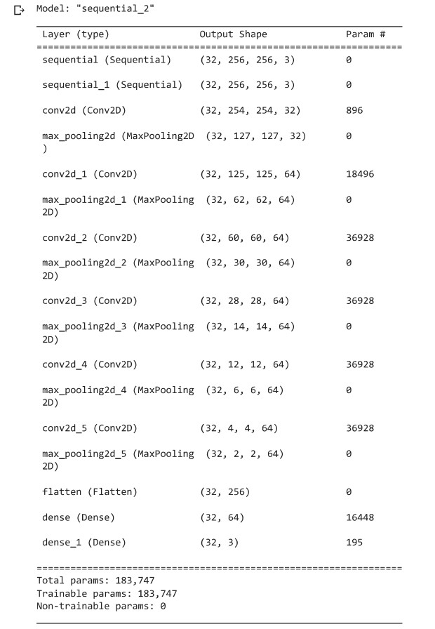
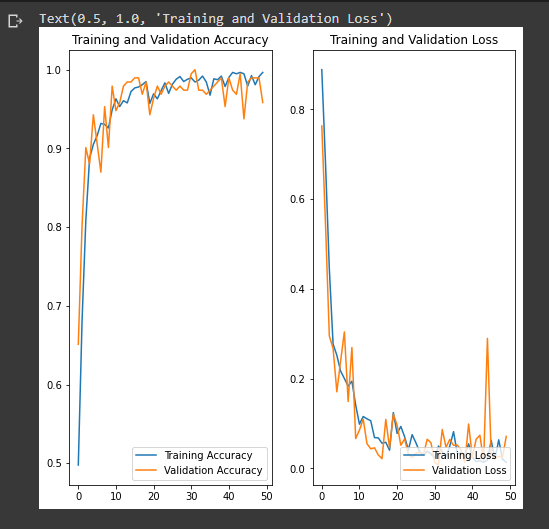

# Potato Leaf Disease Classification

Farmers every year face economic loss and crop waste due to various diseases in potato plants. Early blight and Late blight are major disease of potato leaf. It is estimated that the major loss occurred in potato yield is due to these diseases. Therefore I have desined a neural network model that will classify the potato leaves into three categories: 

1. Healthy 

2. Early Blight

3. Late Blight


Here, I have created a deep learning model for the prediction of the class of potato leaves. And created a user friendly UI to make the use of API easier for farmers. 

## Data Source
[Plant Village Dataset](https://www.kaggle.com/datasets/arjuntejaswi/plant-village?datasetId=414960&sortBy=voteCount)

## Model Summary


## Model Accuracy


## Project Architecture


In this project we are using tf-serving because it makes the process of taking a model into production easier and faster. It allows you to safely deploy new models and run experiments while keeping the same server architecture and APIs. Out of the box, it provides integration with TensorFlow, but it can be extended to serve other types of models.

We are using tf-serving for prediction and Flask server for the easy access of tf-serving API.

## Run Locally
### Clone the repository
```
git clone https://github.com/gaurav2203/Potato-Disease-Classification.git 
cd Potato-Disease-Classification
```
### Install all the dependencies
```
pip3 install -r requirements.txt
```
### Pre-requisite: You should already have docker configured in your machine
### Run tf-serving server
```
docker run -d --rm --name tf-serving  -p 8501:8501 -v <absolute path of project>:/potato-disease tensorflow/serving --rest_api_port=8501 --model_config_file=/potato-disease/models.config &
```
### Start the flask server
```
python3 app.py
```
